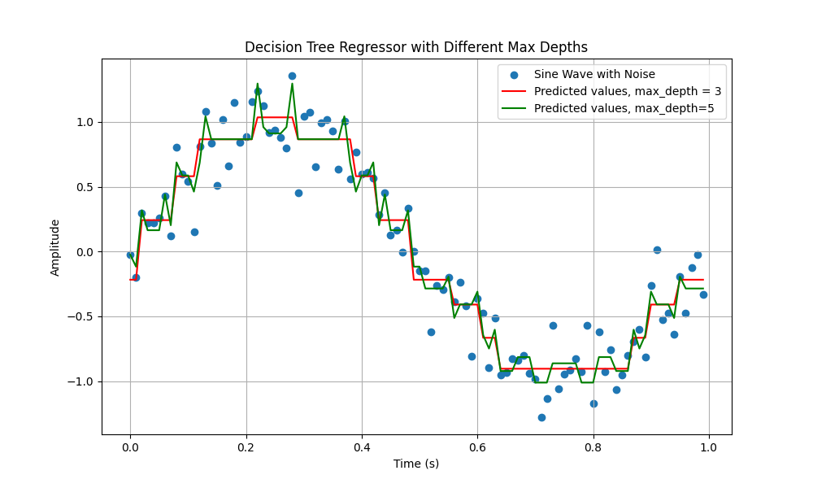

# Clasifiers

Python Classifier Examples with Plots


## Description

This is a repo I use to store various classifiers that I have used or intend to use. Each classifier should contain some plotting examples. 

#


## Getting Started

### Dependencies

* Numpy, Scikit-learn, maplotlib

### Installing

* git clone https://github.com/rlmagee/Classifiers.git

### Executing program

* clone the repo
* cd into the new directory
* create a virtual environment ( )
* activate the venv  
* update pip ( pip install -U pip)


```
python3 -m venv .env
source ./.env/bin/activate
pip install -U pip
pip install numpy, scikit-learn, matplotlib
```


## Authors

Contributors names and contact info

Riley Magee


## Acknowledgments

Inspiration
* [Textbook - Hands on Machine learning with Scikit-Learn, Keras & Tensorflow](https://www.oreilly.com/library/view/hands-on-machine-learning/9781492032632/)
